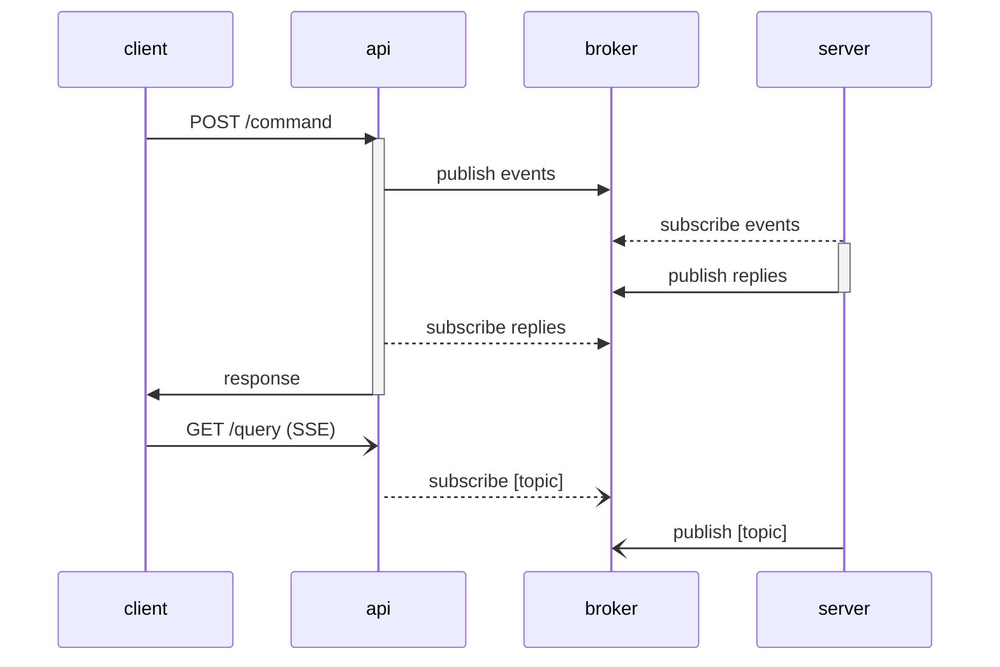

# async-cqrs

Sample application



## Setup

```sh
docker compose up -d

docker compose run --rm rpk topic create commands --brokers redpanda:9092
docker compose run --rm rpk topic create replies --brokers redpanda:9092
```
