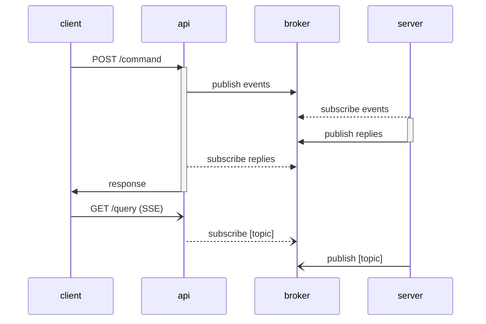

# async-cqrs

Sample application



## Setup

```sh
docker compose up -d

docker compose run --rm rpk topic create commands --brokers redpanda:9092
docker compose run --rm rpk topic create replies --brokers redpanda:9092
```

## Usage

```sh
curl -X POST http://localhost:9090/command -H "Idempotency-Key: 73eb15c7-d554-4bf5-adab-1834f6b3c015"

curl -X POST http://localhost:9090/command -H "Idempotency-Key: 135e4567-e89b-12d3-a456-426614174264"
curl -X POST http://localhost:9090/command -H "Idempotency-Key: 135e4567-e89b-12d3-a456-426614174264"
```
